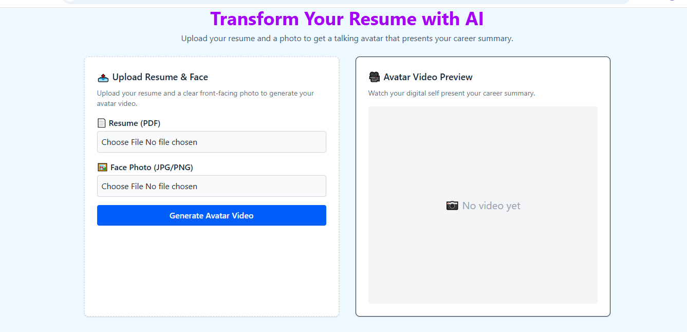
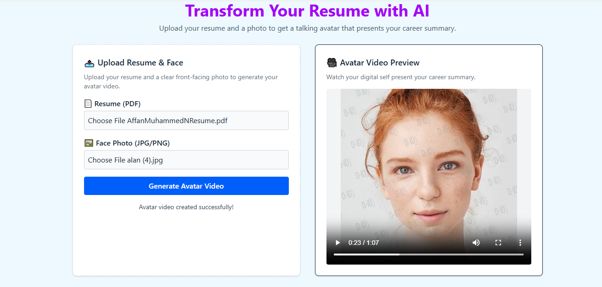

# Visume 🎯

## Basic Details
### Team Name: Hello World

### Team Members
- Team Lead: Alan Joshi George - TKM College of Engineering
- Member 2: Affan Muhammed N - TKM College of Engineering

### Project Description
[2-3 lines about what your project does]

### The Problem (that doesn't exist)
Transform your static resume into an AI-generated talking avatar video. Upload a resume and a photo, and boom — your digital twin introduces you in style.

### The Solution (that nobody asked for)
Resumes are boring. HRs don’t like reading. We solve the problem of “paper not speaking.” Because everyone wants their résumé to talk... right?

## Technical Details
### Technologies/Components Used
Languages: Python, JavaScript
Frameworks: FastAPI (Backend), React.js (Frontend)
Libraries:
pdfplumber for resume parsing
axios, tailwindcss, react
D-ID API for avatar generation
Tools:
Postman (API testing)
VSCode
Git & GitHub

### Implementation
For Software:
# Installation
#Backend
cd backend
python -m venv venv
source venv/bin/activate  # or venv\Scripts\activate on Windows

# Run
cd backend
python -m venv venv
source venv/bin/activate    # or .\venv\Scripts\activate on Windows
pip install -r requirements.txt
uvicorn main:app --reload

cd frontend
npm install
npm run dev                 # or npm start

### Project Documentation
For Software:

# Screenshots (Add at least 3)

*Add caption explaining what this shows*

*Add caption explaining what this shows*

# Diagrams

*Add caption explaining your workflow*

For Hardware:

# Schematic & Circuit

*Add caption explaining connections*

*Add caption explaining the schematic*

# Build Photos

*List out all components shown*

*Explain the build steps*

*Explain the final build*

### Project Demo
# Video
[Add your demo video link here]
*Explain what the video demonstrates*

# Additional Demos
[Add any extra demo materials/links]

## Team Contributions
- [Name 1]: [Specific contributions]
- [Name 2]: [Specific contributions]
- [Name 3]: [Specific contributions]

---
Made with ❤️ at TinkerHub Useless Projects 

